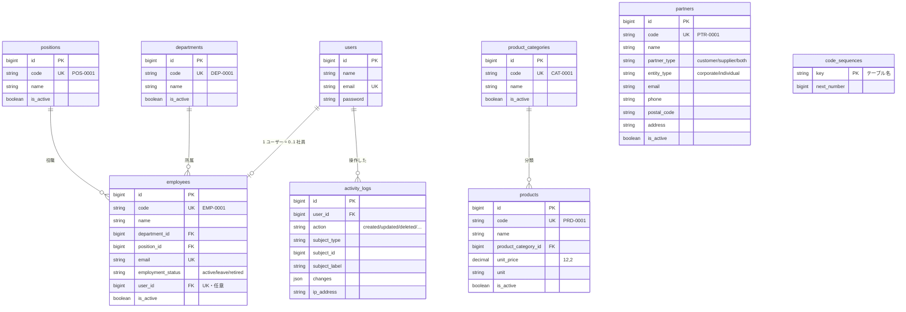

# laravel-business-template

**業務システムを量産するための共通基盤テンプレート**（Laravel 13 / PHP 8.3 / PostgreSQL 16 / Docker）

CRM・受発注・予約・勤怠・EC —— 業務システムは分野が違っても、
「認証」「権限」「マスタ管理」「一覧・検索・CSV」「監査ログ」「ダッシュボード」という土台はほぼ同じです。
このリポジトリは、**その土台だけを完成させたテンプレート**です。

新しい業務システムを始めるときは、これを clone して業務固有のテーブルと画面を足すところから開始できます。
複数システムを同じ構造で作れるため、将来それらを 1 つに統合する際の障壁も小さくなります。

```bash
git clone <this-repo> my-new-system && cd my-new-system
docker compose up -d
docker compose exec app php artisan migrate --seed
open http://localhost:8080
```

---

## 目次

1. [このテンプレの位置づけ](#このテンプレの位置づけ)
2. [主要機能](#主要機能)
3. [セットアップ](#セットアップ)
4. [データモデル（ER 図）](#データモデルer-図)
5. [技術選定と設計判断](#技術選定と設計判断)
6. [設計のハイライト](#設計のハイライト)
7. [テーマを差し替える](#テーマを差し替える)
8. [新しいマスタ画面を追加する](#新しいマスタ画面を追加する)
9. [拡張の指針](#拡張の指針)
10. [ディレクトリ構成](#ディレクトリ構成)
11. [トラブルシューティング](#トラブルシューティング)

---

## このテンプレの位置づけ

### 含まれるもの（業務によらず共通の土台）

- ログイン・権限・ユーザー管理
- 全システムが参照する共通マスタ（社員 / 取引先 / 商品）
- どの一覧画面でも使い回せる検索・ページング・ソート・CSV 出力の基盤
- 「誰が何をしたか」を残す監査ログ
- KPI カードとグラフを差し込むだけのダッシュボードの枠
- 顧客ごとに配色とサービス名を変えるテーマの差し替え口
- Docker 開発環境と CI（整形・静的解析・テスト）

### 含まれないもの（業務固有のためテンプレには入れない）

- 業務トランザクション（受注・予約・勤怠打刻 など）とその画面
- 帳票出力・外部システム連携・決済
- SSO / LDAP / 多要素認証、マルチテナント
  （→ [拡張の指針](#拡張の指針) に、必要になったときの入れ方を書いています）

### 現在の状態

共通基盤としては**完成**しています。テスト 99 件・PHPStan level 5・Pint がすべて通る状態を維持しています。

---

## 主要機能

| 分類 | 機能 | 実装の要点 |
| --- | --- | --- |
| **認証** | ログイン / 新規登録 / パスワード再設定 / プロフィール編集 | Laravel Breeze（Blade 版）。新規登録者には既定ロール `viewer` を自動付与 |
| **権限** | ロール 3 種（管理者 / 担当者 / 閲覧者）と 5 種の権限 | spatie/laravel-permission。定義は PHP の enum に一元化 |
| | メニュー・ボタン・ルートの出し分け | 画面で隠すだけでなくルート側でも必ず検査 |
| | ユーザー管理画面 | `user.manage` を持つ管理者がロールを付け替え |
| **共通マスタ** | 社員 / 取引先 / 商品 + サブマスタ（部署 / 役職 / 商品分類） | 業務コードを自動採番（`EMP-0001` 形式） |
| **一覧基盤** | 検索・絞り込み・ページング（20 件）・ソート | 定義クラスを 1 つ書くだけで全機能が揃う |
| | **検索条件の保持** | 別画面へ移動して戻っても条件が残る（セッション保存） |
| | CSV エクスポート | UTF-8 BOM 付き。現在の絞り込みを反映し全件をストリーミング |
| **共通仕様** | 論理削除 / 有効フラグ / 作成者・更新者の自動記録 | `BaseModel` を継承するだけで有効 |
| **監査ログ** | 作成・更新・削除・復元・ログイン / ログアウト | 1 テーブルに集約。変更内容を JSON で保持 |
| **ダッシュボード** | KPI カード + グラフ + 最近の操作 | Chart.js。中身はコントローラから配列で差し替え |
| **テーマ** | サービス名・ロゴ・配色の切り替え | 設定 1 か所。**アセットの再ビルド不要** |
| **日本語化** | バリデーション / 認証 / 画面文言 | `lang/ja` に集約 |
| **品質** | Pint / Larastan(level 5) / PHPUnit 99 件 | GitHub Actions で自動実行 |

---

## セットアップ

必要なものは **Docker Desktop（または Docker Engine + Docker Compose v2）だけ**です。
ホストに PHP / Composer / Node.js をインストールする必要はありません。

### 1. コンテナを起動

```bash
docker compose up -d
```

初回は `app` コンテナのエントリポイントが `.env` の作成 → `composer install` →
`php artisan key:generate` → `npm install && npm run build` を自動実行します（数分）。
`docker compose logs -f app` で `ready to handle connections` が出れば完了です。

### 2. マイグレーションと初期データ

```bash
docker compose exec app php artisan migrate --seed
```

ロールと権限（必須）に加え、動作確認用のユーザーとマスタのサンプルデータが入ります。
サンプルデータは本番環境では投入されません。

### 3. アクセス

<http://localhost:8080>

| ログイン | ロール | できること |
| --- | --- | --- |
| `admin@example.com` | 管理者 | すべて。削除済みの表示・復元、ユーザーのロール変更 |
| `staff@example.com` | 担当者 | マスタの閲覧・登録・編集・削除 |
| `viewer@example.com` | 閲覧者 | マスタの閲覧と CSV 出力のみ |

パスワードはいずれも `password` です。

### コンテナとポート

| サービス | 役割 | ホスト側ポート |
| --- | --- | --- |
| `web` (`lbt-web`) | Nginx | **8080** → 80 |
| `app` (`lbt-app`) | PHP 8.3-FPM / Composer / Node.js 22 | 5173（Vite 開発サーバー用） |
| `db` (`lbt-db`) | PostgreSQL 16 | **5432** |

ポートは `.env` の `APP_PORT` / `FORWARD_DB_PORT` / `VITE_PORT` で変更できます。

### 品質チェック

```bash
docker compose exec app composer ci      # Pint + Larastan + テスト
```

個別に実行する場合:

```bash
docker compose exec app composer lint       # 整形（自動修正）
docker compose exec app composer analyse    # 静的解析
docker compose exec app php artisan test    # テスト
```

### よく使うコマンド

```bash
docker compose exec app bash                              # コンテナに入る
docker compose exec app php artisan migrate:fresh --seed  # DB を作り直す
docker compose exec app php artisan tinker
docker compose exec app npm run dev                       # Vite 開発サーバー（HMR）
docker compose exec db psql -U app -d business_template   # DB に接続
docker compose down -v                                    # DB のデータごと削除
```

---

## データモデル（ER 図）



すべての業務テーブルは共通カラムを持ちます（図では省略）:
`is_active` / `created_by` / `updated_by` / `created_at` / `updated_at` / `deleted_at`

### 将来の業務システムとの関係

| 今後つくるもの | このテンプレのどれを親にするか |
| --- | --- |
| CRM の顧客・商談 | `partners`（法人）、`employees`（担当者） |
| 受発注の伝票 | `partners`（得意先 / 仕入先）、`products`（明細）、`employees`（担当者） |
| 予約 | `partners`（予約者）、`employees`（担当者） |
| 勤怠 | `employees`、`departments` |
| EC | `products`、`product_categories` |

---

## 技術選定と設計判断

### Blade + Alpine.js（Livewire / Inertia を使わない）

業務システムの画面の大半は「一覧・検索・フォーム」であり、SPA が必要になる場面は限られます。
Blade なら**サーバーサイドだけで完結**し、権限による出し分けもテンプレート上で完結します。
学習コストが低く、担当者が代わっても読めることを重視しました。
動きが要る箇所（ドロップダウン、開閉、フラッシュの消去）だけ Alpine.js を使います。

### Laravel Breeze（Jetstream / Fortify 単体ではなく）

必要なのは「ログインできること」だけで、チーム機能や API トークンは不要でした。
Breeze は**生成されたコードがそのまま自分のリポジトリに入る**ため、
SSO や MFA を足したくなったときに追いやすいという利点もあります。

### spatie/laravel-permission（自前実装ではなく）

権限は「あとから粒度が細かくなる」のが常です。
自前の `is_admin` フラグから始めると必ず作り直しになります。
一方で、パッケージ側にロール定義を持たせると分散するため、
**ロールと権限の定義は PHP の enum に集約**し、パッケージは保存と判定にだけ使っています
（`app/Enums/RoleName.php` が唯一の定義元）。

### BaseModel + トレイト（各モデルに都度書かない）

論理削除・作成者記録・監査ログは「全業務テーブルで漏れなく」効いている必要があります。
継承 1 行で全部が有効になる形にすることで、**付け忘れという事故を構造的に防いでいます**。
マイグレーション側も `$table->masterColumns()` の 1 行に揃えました。

### プレフィックス + 連番のコード体系

`EMP-0001` のような業務コードは、電話や紙でのやり取りで使われるため、
UUID や連番 ID ではなく**人が読んで伝えられる形式**が要件になります。
プレフィックスを付けることで、コードを見ただけで対象が分かります。

### PostgreSQL（MySQL ではなく）

JSON 型・部分インデックス・トランザクショナル DDL・厳密な型チェックが標準で使え、
業務データの整合性を守りやすいことを重視しました。
監査ログの `changes` は JSON 列に保存しています。

### テストも PostgreSQL で実行（SQLite インメモリではなく）

SQLite は速い代わりに、JSON 型・`ilike`・制約の挙動が本番と異なります。
**本番と同じエンジンでテストしなければ、テストが通っても本番で壊れます。**
テスト用 DB（`business_template_testing`）は DB コンテナの初回起動時に自動作成されます。

### Tailwind CSS 4 + CSS カスタムプロパティ

配色を Tailwind の設定に直接書くと、テーマ変更のたびにアセットの再ビルドが必要になります。
Tailwind 4 のユーティリティは `var(--color-primary)` を参照しているため、
**実行時に CSS 変数を上書きするだけで配色が切り替わる**構成にしました（→ [テーマを差し替える](#テーマを差し替える)）。

---

## 設計のハイライト

業務システムで実際に問題になりやすい箇所への対処をまとめます。

### 1. 採番の重複を行ロックで防ぐ

`code_sequences` テーブルで採番系列ごとにカウンタを持ち、
払い出し時に `SELECT … FOR UPDATE` で行ロックを取ります。
2 人が同時に登録しても `EMP-0005` が 2 件できることはありません。

```php
// app/Support/Code/CodeGenerator.php
return DB::transaction(function () use (...) {
    CodeSequence::query()->insertOrIgnore([...]);            // ON CONFLICT DO NOTHING
    $sequence = CodeSequence::query()->lockForUpdate()->findOrFail($key);
    // …払い出してインクリメント
});
```

削除しても番号は再利用しません（`EMP-0001` を削除しても次は `EMP-0002`）。
採番後にトランザクションが失敗すると欠番が出ますが、
**業務コードは連続性より一意性が重要**なため、これを許容する設計にしています。

データ移行でコードを指定した場合は採番をスキップし、
取り込み後に `CodeGenerator::syncTo('employees', 1500)` でカウンタを合わせられます。

### 2. 監査ログを「付け忘れられない」形にする

コントローラでログを書く設計だと、必ずどこかで書き漏れます。
`LogsActivity` トレイトが Eloquent のモデルイベントを購読し、
**保存経路に関係なく**作成・更新・削除・復元を記録します。

- `password` / `remember_token` は自動的に除外
- 監査カラム（`created_by` / `updated_by`）も除外
  （含めると、復元時に「`updated_by` だけが変わった更新」という無意味なログが増えるため）
- 実質的な変更がない更新は記録しない
- 一括取込などでは `Model::withoutActivityLog(fn () => …)` で抑止できる

### 3. 一覧の共通化を「定義」と「実装」に分ける

各マスタが書くのは**何を出すかの定義だけ**で、
検索・絞り込み・ソート・ページング・削除済みの扱い・CSV は共通実装が担当します。

```php
class EmployeeTable extends TableDefinition
{
    public function query(): Builder { return Employee::query()->with('department:id,name'); }
    public function columns(): array { /* 列と、その列が並び替え可能か */ }
    public function searchable(): array { return ['code', 'name', 'email']; }
    public function filters(): array { /* セレクトボックスの定義 */ }
    public function toCsvRow(Model $model): array { /* CSV 1 行 */ }
}
```

**定義にない列名でのソートは無視します。** `?sort=password` のような URL 直打ちが
そのまま SQL に渡ることはありません。

### 4. 検索条件をセッションに保持する

業務システムでは「一覧で絞り込む → 1 件編集する → 一覧に戻る」を延々と繰り返します。
戻るたびに条件が消えると実用に耐えません。
条件はマスタごとにセッションへ保存し、条件なしで一覧を開いたときに復元します（`?reset=1` でクリア）。

### 5. CSV のインジェクション対策

CSV は Excel で開かれます。`=cmd|'/c calc'!A1` のような値をそのまま出力すると、
**開いた人の PC で数式として実行され得ます**。
先頭が `=` `+` `-` `@` の値にはシングルクォートを付けて無効化しています。
併せて、文字化けを防ぐ UTF-8 BOM と、Excel が期待する CRLF 改行で出力します。

大量データでもメモリを使い切らないよう、`lazy()` で 1 行ずつストリーミングします。

### 6. 権限は「画面で隠す」だけにしない

メニューやボタンは `@can` で隠しますが、それは UI 上の配慮にすぎません。
**ルート側でも必ず権限ミドルウェアで検査**しています。
URL を直接叩いた場合は 403 になることをテストで担保しています。

削除済みの表示・復元も同様で、管理者以外は
`?trashed=only` を付けても削除済みデータが 1 件も返りません。

### 7. is_active と論理削除を使い分ける

| | 意味 | 見え方 |
| --- | --- | --- |
| `is_active = false` | 今後は使わないが、過去データからは参照される | 「無効」として一覧に表示 |
| `deleted_at` あり | 誤登録などで無かったことにしたい | 管理者以外には表示されない |

「退職した社員」は `employment_status = retired` かつ `is_active = false` であって、
削除ではありません。過去の伝票から参照され続けるためです。

### 8. ダッシュボードを「枠」として作る

`DashboardController` は KPI とグラフを**配列で組み立ててビューに渡すだけ**です。
ビューは配列を受け取って並べるだけなので、
各業務システムではコントローラの中身を差し替えればレイアウトはそのまま使えます。

```php
new Kpi(label: '社員', value: 32, unit: '名', href: route('masters.employees.index'));
Chart::doughnut('partner-type', '取引先区分の内訳', ['得意先' => 10, '仕入先' => 11]);
```

Chart.js の設定は PHP 側で組み立て、Blade は `<canvas data-chart="{JSON}">` を置くだけです。
**グラフごとに JavaScript を書く必要はありません。** グラフの色はテーマ設定から取るため、
配色を変えるとグラフも追従します。

---

## テーマを差し替える

顧客ごと・システムごとに見た目を変えるための差し替え口です。
**設定を変えるだけで、アセットの再ビルドは不要**です。

### 手順

**1. `.env` を編集する**（`config/theme.php` の既定値を上書きします）

```dotenv
THEME_NAME="Acme 販売管理"
THEME_TAGLINE="株式会社Acme 社内システム"
THEME_PRIMARY="#c026d3"
THEME_ACCENT="#ea580c"
THEME_LOGO="images/acme-logo.svg"   # public/ 配下のパス。未設定なら頭文字マーク
```

**2. 設定キャッシュをクリアする**

```bash
docker compose exec app php artisan config:clear
```

**3. ブラウザを再読み込みする**

以上です。これだけで次がまとめて切り替わります。

- ブラウザのタブ・ヘッダー・ログイン画面の**サービス名**
- ヘッダーとログイン画面の**ロゴ**（未設定ならサービス名の頭文字を使ったマーク）
- ボタン・リンク・選択中メニュー・バッジ・フォーカスリングの**配色**
- **グラフの配色**（1 色目に primary、2 色目に accent）

### 仕組み

`config/theme.php` の色は `<head>` に CSS カスタムプロパティとして注入されます。

```html
<style>:root{--color-primary:#c026d3;--color-accent:#ea580c;}</style>
```

Tailwind 4 のユーティリティ（`bg-primary` など）は `var(--color-primary)` を参照しているため、
この変数を上書きするだけで全体が切り替わります。
ホバー時の色や淡いバッジ背景は `color-mix()` で primary から自動的に派生するので、
指定するのは 2 色だけで済みます。

```css
/* resources/css/app.css */
--color-primary-hover:   color-mix(in oklab, var(--color-primary) 82%, white);
--color-primary-soft:    color-mix(in oklab, var(--color-primary) 12%, white);
--color-primary-soft-fg: color-mix(in oklab, var(--color-primary) 78%, black);
```

`<style>` に直接埋め込むため、設定値は CSS の色として妥当な形式かを検査したうえで出力し、
不正な値は既定色にフォールバックします（`App\Support\Theme\Theme`）。

### 既定テーマ

業務システム向けのニュートラルな配色（インディゴ + シアン）です。
グレースケールを基調に、操作可能な要素だけに色を使う方針にしています。

### さらに踏み込んで変えたい場合

グレー基調そのものやフォントを変える場合は `resources/css/app.css` の `@theme` を編集し、
`npm run build` を実行してください（この場合は再ビルドが必要です）。

---

## 新しいマスタ画面を追加する

1 マスタあたり **定義 1 + コントローラ 1 + ビュー 2 + ルート 1 行**で追加できます。

**① マイグレーションとモデル**

```php
Schema::create('warehouses', function (Blueprint $table) {
    $table->id();
    $table->string('code', 32)->unique();
    $table->string('name', 100);
    $table->masterColumns();   // is_active / created_by / updated_by / timestamps / deleted_at
});
```

```php
class Warehouse extends BaseModel
{
    use HasSequentialCode;

    protected $fillable = ['name', 'is_active'];

    public static function codePrefix(): string
    {
        return 'WHS';   // → WHS-0001
    }
}
```

**② 一覧の定義**（`app/Tables/WarehouseTable.php`）

`TableDefinition` を継承し、列・検索対象・絞り込み・CSV の 1 行を書きます。

**③ コントローラ**（`app/Http/Controllers/Masters/WarehouseController.php`）

`MasterController` を継承すると、一覧・CSV・論理削除・復元は実装済みです。
登録 / 編集フォームの処理だけ書きます。
「コード + 名称」だけのマスタなら `SimpleMasterController` を継承すればそれも不要です
（部署・役職・商品分類がこの形で、画面も 3 マスタで共有しています）。

**④ ルート**（`routes/web.php`）

```php
MasterRoutes::register('warehouses', WarehouseController::class, 'warehouses');
```

一覧・CSV に `master.view`、登録・編集・削除・復元に `master.manage` が自動で設定されます。

**⑤ ビュー**（`resources/views/masters/warehouses/index.blade.php`）

```blade
<x-master-index :table="$table" :resource-label="$resourceLabel" :route-name="$routeName">
    @foreach ($table->items() as $record)
        <tr>
            <td class="px-4 py-3 font-mono text-xs">{{ $record->code }}</td>
            <td class="px-4 py-3">{{ $record->name }}</td>
            <td class="px-4 py-3 text-center"><x-active-badge :active="$record->is_active" /></td>
            <td class="px-4 py-3">{{ $record->updated_at?->format('Y/m/d H:i') }}</td>
            <x-master-row-actions :record="$record" :route-name="$routeName" :resource-label="$resourceLabel" />
        </tr>
    @endforeach
</x-master-index>
```

検索フォーム・ページャ・CSV ボタン・削除済み切り替えは `<x-data-table>` が描画するため書く必要はありません。

### コード体系

| マスタ | 例 | | マスタ | 例 |
| --- | --- | --- | --- | --- |
| 社員 | `EMP-0001` | | 部署 | `DEP-0001` |
| 取引先 | `PTR-0001` | | 役職 | `POS-0001` |
| 商品 | `PRD-0001` | | 商品分類 | `CAT-0001` |

形式は **プレフィックス + `-` + 4 桁ゼロ埋めの連番**。連番はマスタごとに独立しています。
4 桁を超えると自動的に桁が増えます（`EMP-10000`）。画面からの入力・変更はできません。

---

## 拡張の指針

このテンプレは「最小で完成している」状態です。
以下は**あえて入れていない**もので、必要になったときに足せるよう設計してあります。

### 認証方式

| 要件 | 拡張方法 |
| --- | --- |
| SAML / OIDC による SSO | `laravel/socialite` + `socialiteproviders` を追加し、ログイン導線を差し替える |
| LDAP / Active Directory | `directorytree/ldaprecord-laravel` を追加し、認証ドライバを差し替える |
| 多要素認証（MFA / TOTP） | `laravel/fortify` の二要素認証を有効化する |
| メールアドレス確認の必須化 | `App\Models\User` に `MustVerifyEmail` を実装する |

Breeze は生成コードがリポジトリ内にあるため、置き換えではなく**追記**で対応できます。

### 権限をマスタ単位に分割する

現在は全マスタを `master.view` / `master.manage` の 2 権限で制御しています。
「社員マスタは人事だけ、取引先マスタは営業だけ」のように分ける場合:

1. `app/Enums/PermissionName.php` に `employee.view` / `employee.manage` などを追加し、
   `RoleName::permissions()` を更新
2. `app/Support/Routing/MasterRoutes.php` の `register()` が権限名を引数で受け取れるようにし、
   `routes/web.php` からマスタごとに指定

画面側は `@can('...')` の権限名を変えるだけです。

削除済みの表示・復元は現在「admin ロールかどうか」（`User::isAdmin()`）で判定しています。
専用の権限に変える場合は `MasterController::canManageDeleted()` の 1 メソッドを差し替えてください。

### マルチテナント（会社・部署単位のデータ分離）

未実装です。導入する場合は、`BaseModel` にグローバルスコープを追加して
テナント ID による絞り込みを全モデルへ一括で効かせるのが、この構成では最も破綻しにくい方法です。
`masterColumns()` にテナント列を足せば、マイグレーション側も 1 か所で揃います。

### その他

| 要件 | 方針 |
| --- | --- |
| CSV インポート | `HasSequentialCode` はコード指定時に採番をスキップするため取込に対応済み。画面とエラー行の表示のみ追加が必要 |
| 添付ファイル | ストレージ方針（ローカル / S3）を決めたうえで `config/filesystems.php` を設定 |
| 伝票番号の採番 | `CodeGenerator` は系列キーを自由に取れるため、`sales_orders:2026` のような年度別キーで年度リセットにも対応可能 |
| 本番デプロイ | 現在の Dockerfile は開発用（バインドマウント・`APP_DEBUG=true`）。本番はマルチステージビルドと opcache 最適化、キュー worker の分離が必要 |

---

## ディレクトリ構成

```
app/
├── Enums/                      # ロール / 権限 / 業務区分の定義
│   ├── RoleName.php            #   ロールと保有権限（唯一の定義元）
│   ├── PermissionName.php
│   ├── EmploymentStatus.php    #   在籍 / 休職 / 退職
│   ├── PartnerType.php         #   得意先 / 仕入先 / 両方
│   └── EntityType.php          #   法人 / 個人
├── Http/
│   ├── Controllers/
│   │   ├── DashboardController.php   # ダッシュボードの枠
│   │   ├── Masters/                  # マスタ画面（MasterController が共通処理）
│   │   └── UserController.php        # ロール管理
│   └── Requests/Masters/             # 入力チェック
├── Models/
│   ├── BaseModel.php           # 業務テーブル用の基底モデル
│   ├── Employee.php / Partner.php / Product.php
│   ├── Department.php / Position.php / ProductCategory.php
│   ├── ActivityLog.php / CodeSequence.php
│   └── Concerns/               # 共通仕様のトレイト
│       ├── HasSequentialCode.php   #   コード自動採番
│       ├── HasActiveFlag.php       #   有効フラグ
│       ├── HasAuditColumns.php     #   created_by / updated_by
│       └── LogsActivity.php        #   監査ログ
├── Support/
│   ├── Code/CodeGenerator.php  # 採番（行ロック）
│   ├── DataTable/              # 共通一覧基盤
│   ├── Dashboard/              # KPI / グラフの値オブジェクト
│   ├── Routing/MasterRoutes.php
│   └── Theme/Theme.php         # テーマ差し替え口
└── Tables/                     # 各マスタの一覧定義

config/
├── theme.php                   # サービス名・ロゴ・配色
└── activity_log.php            # 監査ログの ON/OFF

resources/
├── css/app.css                 # Tailwind 4 + テーマトークン
├── js/{app.js,charts.js}       # Alpine.js / Chart.js
└── views/
    ├── components/             # data-table / master-index / dashboard など共通部品
    ├── masters/                # 各マスタ画面（simple/ は 3 サブマスタで共有）
    ├── partials/theme.blade.php
    └── users/

docker/                         # Dockerfile / nginx / postgres 初期化
lang/ja/                        # 日本語メッセージ
tests/                          # 99 件
.github/workflows/ci.yml
phpstan.neon / pint.json
```

### CI

`main` への push と Pull Request で以下を実行します。

1. Pint による整形チェック
2. Larastan による静的解析（PHPStan level 5）
3. PostgreSQL 16 を起動して `php artisan test`

### データベース接続情報

| 項目 | コンテナ内から | ホスト（GUI ツール）から |
| --- | --- | --- |
| ホスト | `db` | `localhost` |
| ポート | `5432` | `5432`（`FORWARD_DB_PORT`） |
| データベース | `business_template` | 同左 |
| ユーザー / パスワード | `app` / `secret` | 同左 |

テスト用: `business_template_testing`（DB コンテナ初回起動時に自動作成）

---

## トラブルシューティング

**ポートが既に使われている**
`.env` の `APP_PORT`（既定 8080）や `FORWARD_DB_PORT`（既定 5432）を変更し、
`docker compose down && docker compose up -d` を実行してください。

**Vite manifest not found と表示される**
`docker compose exec app npm run build` を実行してください。

**テーマを変えたのに反映されない**
`docker compose exec app php artisan config:clear` を実行してください。

**ログイン後に 403 が表示される**
そのユーザーにロールが割り当てられていません。管理者が `/users` から割り当てるか、次で付与します。

```bash
docker compose exec app php artisan tinker
>>> App\Models\User::where('email', 'foo@example.com')->first()->assignRole('admin');
```

**テストが「database ... does not exist」で失敗する**
テスト用 DB は DB コンテナの初回起動時のみ作成されます。既存ボリュームの場合は手動で作成します。

```bash
docker compose exec db psql -U app -d business_template -c 'CREATE DATABASE business_template_testing OWNER app;'
```

**Linux でファイルの所有権が root になる**

```bash
UID=$(id -u) GID=$(id -g) docker compose build --no-cache app
docker compose up -d
```

**環境を完全に作り直したい**

```bash
docker compose down -v
rm -rf vendor node_modules public/build
docker compose up -d
docker compose exec app php artisan migrate --seed
```
